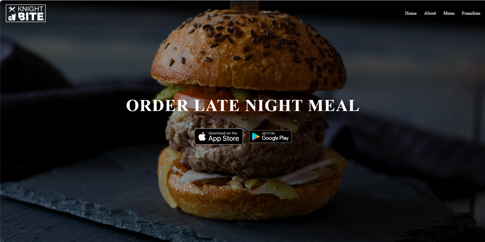
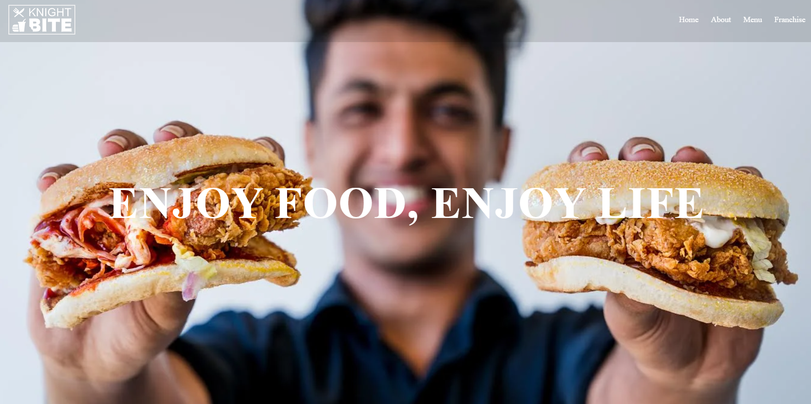
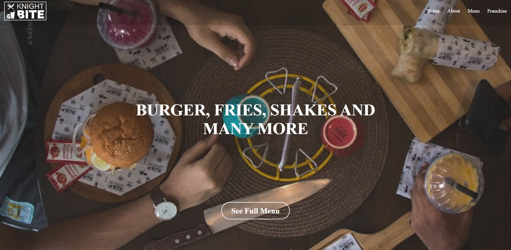
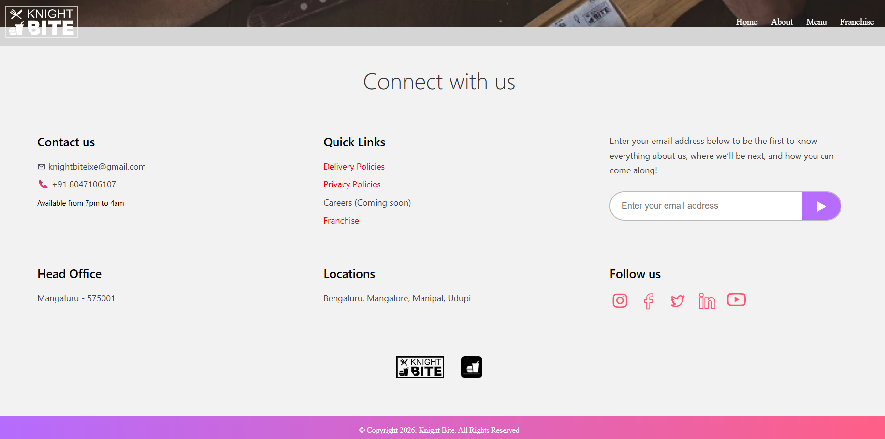
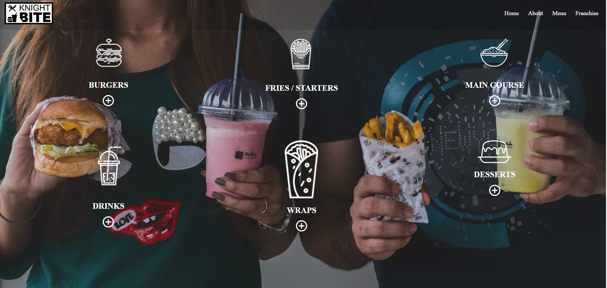
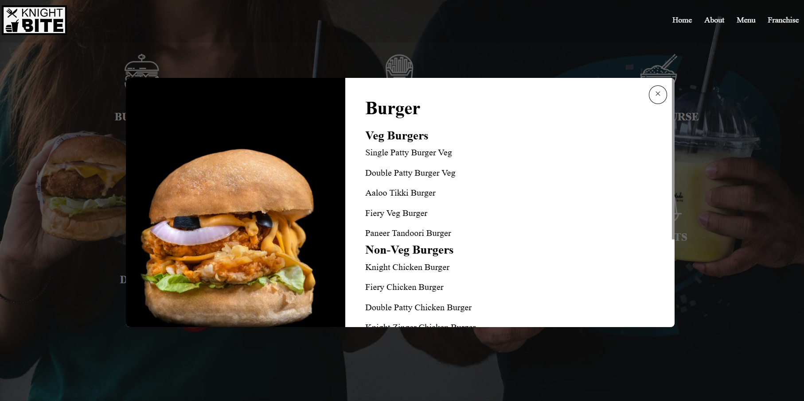
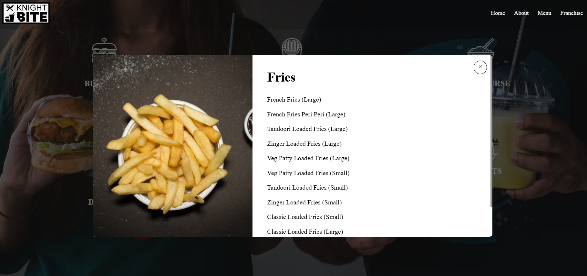
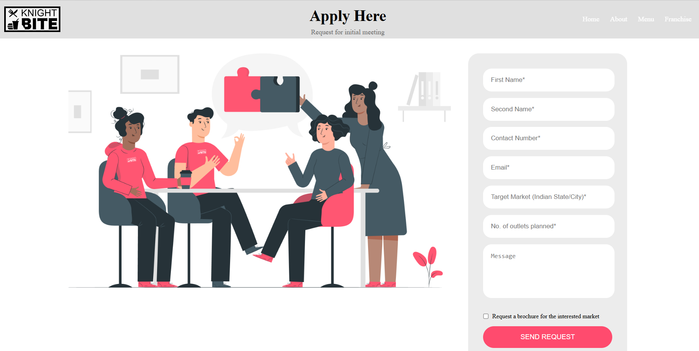

# 🍔 Knight Bites - Food Ordering Website

## 🚀 Live Demo
knight-bite-project.netlify.app

## 📌 Description
This is a responsive food ordering frontend website built using HTML, CSS, JavaScript, and Bootstrap.

## ✨ Features
- Responsive design
- Attractive UI
- Food menu display
- Smooth navigation

## 🛠️ Tech Stack
- HTML5
- CSS3
- JavaScript
- Bootstrap

## 📸 Screenshots

